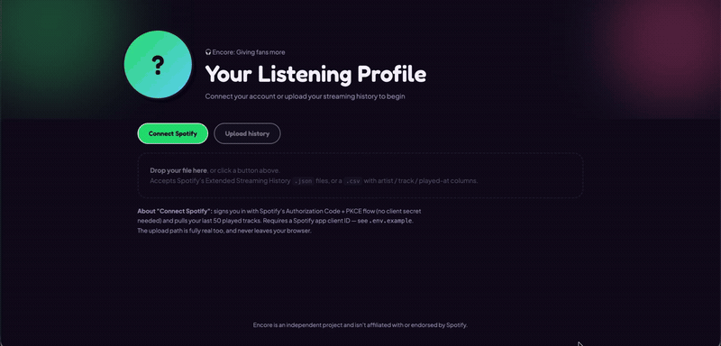

# Encore: Fan Score

A small React + TypeScript app that computes a per-artist "fan score" from
your Spotify listening history — connect your account or upload the export (WIP).



## Run it

```bash
npm install
npm run dev
```

Then open the local URL Vite prints (usually `http://localhost:5173`).

## How it's organized

```
src/
  utils/
    types.ts     — shared interfaces (StreamRecord, ArtistDetail, Library, ...)
    parse.ts     — turns Spotify's exported .json/.csv into plain records
    score.ts     — groups records by artist and computes the fan score
  components/
    Hero.tsx           + Hero.css           — profile header
    EntryActions.tsx   + EntryActions.css   — connect / upload buttons + dropzone
    ArtistSearch.tsx   + ArtistSearch.css   — search box for any artist in your history
    ArtistChips.tsx    + ArtistChips.css    — horizontal strip of top artists
    ScorePanel.tsx      + ScorePanel.css     — score gauge + tier + breakdown bars
    StatsGrid.tsx       + StatsGrid.css      — stat cards for the selected artist
    TrackList.tsx       + TrackList.css      — that artist's top tracks
```

## Getting real Spotify data in

- **Upload path (WIP):** go to `spotify.com/account/privacy` →
  "Download your data" → request **Extended streaming history**. It arrives
  by email as a zip of `StreamingHistory_music_*.json` files, drop those
  straight into the app.
- **"Connect Spotify" button:** signs in via Spotify's Authorization Code +
  PKCE flow (no client secret needed, it runs entirely in the browser) and
  pulls your last 50 played tracks from `/me/player/recently-played`. To use
  it:
  1. Create an app at [developer.spotify.com/dashboard](https://developer.spotify.com/dashboard).
  2. In the app's settings, add a Redirect URI (e.g. `http://127.0.0.1:5173/`)
     for local dev.
  3. Copy `.env.example` to `.env` and fill in `VITE_SPOTIFY_CLIENT_ID` (and
     `VITE_SPOTIFY_REDIRECT_URI` if it differs from the default).
  4. Restart `npm run dev`.

  The relevant code: `src/utils/spotifyAuth.ts` (the PKCE dance) and
  `src/utils/spotifyApi.ts` (fetching + mapping recently played tracks),
  wired up in `App.tsx`.
